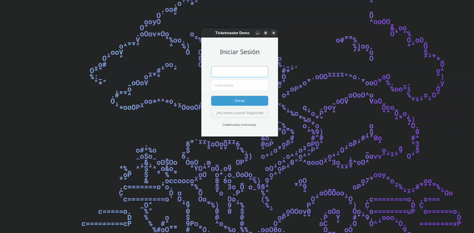

Sistema Ticketmaster desarrollado en Java y JavaFX para la gestión y compra de boletos de entretenimiento, incluyendo módulos de teatro, cine y museo, autenticación con CURP, envío de boletos por WhatsApp y aplicación de pruebas funcionales y no funcionales.

